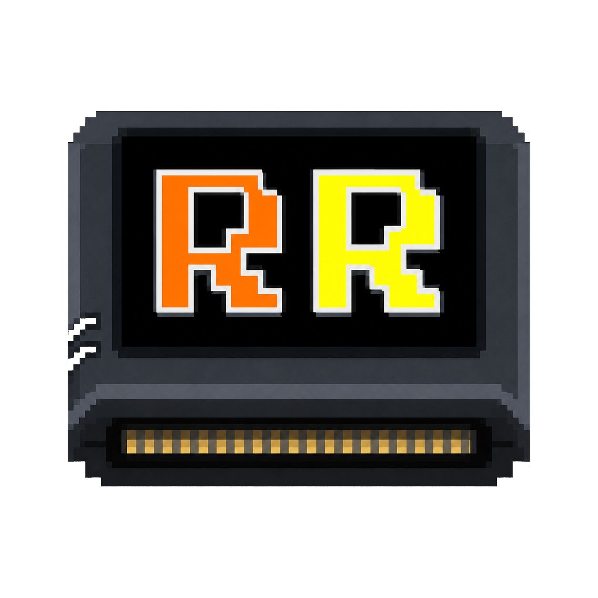
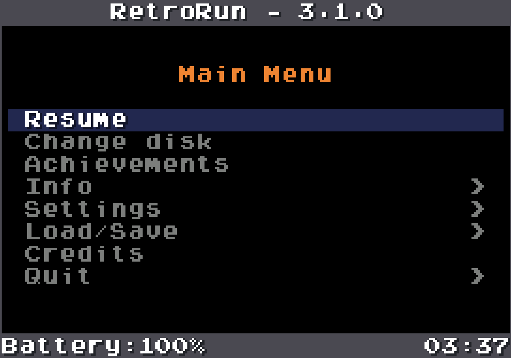

# RetroRun

<p align="center">
  
</p>

RetroRun is a lightweight libretro frontend for Linux handhelds and desktop
systems. It was originally designed for Anbernic devices using the GO2/DRM
graphics stack and now provides a platform abstraction for input, audio and
video, with an additional SDL2 backend for macOS and Linux.

## Highlights

- **Save states:** create and load states from the on-screen menu or controller
  shortcuts, choose between multiple slots, and optionally save and restore a
  state automatically when starting or closing a game.
- **Multi-disc games:** change the active CD, GD-ROM or other removable image
  while playing, using RetroRun's file browser and the libretro disk-control
  interface exposed by compatible cores.
- **Bezels and screen decorations:** automatically reuse installed AmberELEC
  and ArkOS bezel packs, select artwork per game or system, honour custom
  libretro and Batocera-style viewports, or download and manage a curated set
  directly from the menu. Alpha-composited artwork is cached and accelerated
  by RGA on supported GO2 devices.
- **RetroAchievements:** sign in from the frontend, identify supported games,
  browse locked and unlocked achievements with their badges, and display game
  identification and unlock notifications. Official achievements, optional
  unofficial achievements and Encore mode are supported in softcore mode, and
  the integration can be disabled.
- **Complete on-screen interface:** pause and resume games, inspect device,
  core, graphics and network information, change runtime video, audio, volume
  and brightness settings, manage save states and exit cleanly without leaving
  the frontend.
- **Fast-forward and frame control:** uncapped fast-forward with configurable
  frame presentation, optional adaptive or fixed frameskip, VSync and frontend
  frame pacing.
- **Flexible video output:** software and OpenGL/OpenGL ES cores, automatic or
  selectable aspect ratios, pixel-perfect scaling, Tate rotation, nearest or
  linear filtering, scanlines, CRT effects and optional screen decorations.
- **Handheld-oriented input:** controller remapping, analog-to-D-pad modes,
  Tate-aware directional controls, analog sticks, triggers, rumble and
  configurable controller shortcuts.
- **Useful frontend tools:** screenshots, an unrestricted FPS counter,
  a startup loading screen, icon-and-text notifications and an on-screen
  keyboard with upper- and lowercase input.
- **Portable backends:** native GO2/DRM support for compatible Anbernic devices
  and an SDL2 backend for Linux handhelds, Linux desktops and macOS.
- **Configurable cores and diagnostics:** per-core libretro options, separate
  frontend and core log levels, timestamped logs and selectable save, system
  and screenshot directories.

The native backend remains available for the RG351 M/P/V/MP, RG552, RG503,
RG353M, RG353V and Miniloong Pocket 1. The Pocket 1's portrait DRM panel is
rotated natively, including both Tate directions and direct scanout. The SDL2 backend provides an alternative implementation for
Linux handheld distributions such as AmberELEC, ArkOS/dArkOS and other devices
that provide SDL2, KMSDRM and OpenGL ES 3.

The Linux SDL2 backend must still be tested on each physical device. Controller
mapping, screen rotation, audio driver and performance can vary between models
and distributions.

- [Changelog](changelog.txt)
- [Porting guide](PORTING.md)
- [Benchmark and remote validation runbook](doc/BENCHMARK_IMPLEMENTATION_RUNBOOK.md)
- [RG353M benchmark summary](doc/BENCHMARK_RG353M_RESULTS.md)
- [RG353M dArkOS stack comparison](doc/BENCHMARK_RG353M_DARKOS_COMPARISON.md)
- [RG353M SDL2 rendering investigation](doc/SDL2_RG353M_RENDERING_INVESTIGATION.md)
- [Flycast 2021 RK3326 optimization handoff](doc/FLYCAST2021_RK3326_OPTIMIZATION_HANDOFF.md)
- [Project TODO](doc/TODO.txt)

### Artwork attribution

On-screen interface icons are derived from
[Streamline Core Line Free](https://www.streamlinehq.com/icons/core-line-free),
licensed under [CC BY 4.0](https://creativecommons.org/licenses/by/4.0/).
Icons by [Streamline](https://streamlinehq.com).

## Backends and build outputs

| Host or target | Backend | Build command | Output |
| --- | --- | --- | --- |
| Anbernic Linux, default | Native GO2/DRM | `make config=release` | `retrorun` |
| Linux handheld or desktop | SDL2 + OpenGL ES | `make sdl2 config=release` | `retrorun-sdl2` |
| macOS | SDL2 + Desktop OpenGL | `make` | `retrorun` |

On Linux, the GO2 backend intentionally remains the default for compatibility
with existing AmberELEC packages and supported Anbernic devices. Building the
SDL2 target produces a separate executable and does not replace `retrorun`.

## On-screen menu

RetroRun includes an OSD menu shared by the native GO2/DRM and SDL2 backends.
It can pause and resume the active core and provides access to device, core and
game information, runtime settings, save states, credits and clean shutdown.
Each menu remembers its selected item when entering a submenu and returning.
The read-only **Info > Graphics** page reports the active platform backend,
renderer, software or hardware core path, output and core resolutions, pixel
format, aspect ratio, filter, shader, VSync, pixel-perfect state and UI profile.
On native DRM builds, **Info > DRM diagnostics** reports the selected direct
scanout policy, DRM driver and panel mode, connector/CRTC and plane identifiers,
plane format and rotation support, page-flip fallback state, direct-scanout
result and sampled VBlank latency/failures. These values make it easier to
compare device-specific DRM behaviour without enabling permanent debug timing.
Pressing A from this page opens a confirmation prompt for a three-second test
on the running game. During the test RetroRun temporarily forces direct scanout,
suppresses frontend/game input and overlays, then restores the previous state
and reopens the diagnostics page; the configured policy is not changed.
The default controller shortcut is L3 + R3; alternative Select/F2 shortcuts
can be enabled with `retrorun_alternative_input_mode`.

The menu uses clipped, time-based text scrolling for labels wider than the
available area. Its UI profile can be changed under **Settings > Video**:

- `auto` keeps the original compact layout on recognized Anbernic devices and
  selects the responsive desktop layout on macOS, Windows and regular Linux PCs;
- `handheld` always uses the original 240x160 menu canvas;
- `desktop` derives the menu canvas from the window size so that text remains
  approximately 16 pixels high instead of being enlarged with the game image.

<p align="center">
  
</p>

## Tested cores

Core compatibility depends on the backend, architecture and distribution. The
following families have historically been tested with RetroRun:

- Dreamcast, Naomi and Atomiswave: Flycast and Flycast 2021.
- Nintendo 64: ParaLLEl N64.
- PlayStation: SwanStation, DuckStation and PCSX-ReARMed.
- PSP: PPSSPP.
- Super Nintendo: Snes9x variants and bsnes2014.
- Game Boy Advance: mGBA and VBA-M.
- Mega Drive/Genesis: Genesis Plus GX and PicoDrive.
- Atari: Stella and Virtual Jaguar.
- DOS: DOSBox Pure and DOSBox Core.
- Other cores including Beetle VB and Yaba Sanshiro.

A core shared library must use the same CPU architecture as RetroRun. For
example, a 32-bit core requires a 32-bit RetroRun executable and compatible
libraries.

## Building

Clone the repository first:

```sh
git clone https://github.com/navy1978/retrorun.git
cd retrorun
```

### Native GO2/DRM backend

On a supported Linux toolchain, the default command builds the historical
Anbernic backend:

```sh
make config=release
```

The native build uses DRM/GBM, EGL/OpenGL ES, RGA, evdev, ALSA and OpenAL. It is
normally cross-compiled inside the AmberELEC or device-distribution build
environment, where those libraries and their target headers are available.

The backend can also be selected explicitly:

```sh
make go2 config=release
```

#### RK3326 Mali compatibility build

ArkOS/dArkOS and AmberELEC normally expose the unversioned EGL, GLES and GBM
linker names through the same proprietary RK3326 Mali GBM library. Building on
a generic Linux VM can instead record versioned GLVND/Mesa dependencies such as
`libEGL.so.1`, causing EGL initialization to fail on an otherwise supported
handheld.

The helper can download the dArkOS RK3326 blob pinned to a known source commit,
verify its SHA-256 and retain it outside the repository in the user cache:

```sh
tools/build-rk3326-mali.sh --download-mali
```

The download is never implicit. For offline builds, pass an existing AArch64
RK3326 Mali GBM blob instead:

```sh
tools/build-rk3326-mali.sh \
  --mali-lib /path/to/libmali-bifrost-g31-rxp0-gbm.so
```

The output is `dist/retrorun-rk3326-mali`. The helper temporarily presents the
blob as `libEGL.so`, `libGLESv2.so` and `libgbm.so`, performs a clean release
GO2 build, and then removes all temporary links and intermediate build files.
It rejects GLVND/Mesa-style `DT_NEEDED` entries and prints the highest GLIBC
version required by the executable.

To enforce the ABI ceiling of the oldest target distribution, pass its GLIBC
version explicitly:

```sh
tools/build-rk3326-mali.sh \
  --download-mali \
  --max-glibc 2.31
```

The version above is only an example; determine the actual ceiling on the
oldest supported image. Passing the ELF checks prevents the known EGL loader
mismatch, but a release should still be tested on both ArkOS/dArkOS and
AmberELEC before being labelled as a universal binary.

### Linux SDL2/KMSDRM backend

Required target dependencies are:

- a C++20 compiler;
- SDL2 development files;
- libpng and pkg-config;
- EGL, OpenGL ES 3 headers and `libGLESv2`;
- an SDL2 build with KMSDRM support when running without X11 or Wayland.

Build the alternative backend with either command:

```sh
make PLATFORM=sdl2 config=release
```

```sh
make sdl2 config=release
```

Both commands create `retrorun-sdl2`. The build variables `CXX`, `SDL_CONFIG`,
`PKG_CONFIG`, `SDL_CFLAGS`, `SDL_LIBS`, `PNG_CFLAGS`, `PNG_LIBS`,
`GLES_CFLAGS` and `GLES_LIBS` can be overridden for a cross-compilation
sysroot. For example:

```sh
make sdl2 config=release \
  CXX=aarch64-linux-gnu-g++ \
  SDL_CONFIG=/path/to/sysroot/usr/bin/sdl2-config \
  PKG_CONFIG=/path/to/target-pkg-config
```

Do not copy a macOS or x86-64 Linux executable to an ARM handheld. RetroRun,
the libretro core and all linked libraries must be built for the target CPU and
ABI.

### Hybrid GO2 video/input with selectable audio

The experimental hybrid target retains the native GO2/DRM video and evdev
input paths while including both the native OpenAL and SDL2 queued-audio
providers:

```sh
make PLATFORM=linux-go2-hybrid config=release
```

The output is `retrorun-hybrid`. Select the playback provider before launch in
`retrorun.cfg`:

```ini
retrorun_audio_backend = sdl2
```

Accepted values are `auto`, `go2` (or `openal`) and `sdl2` (or `sdl`). `auto`
preserves the GO2 default. SDL2 initializes only its audio subsystem in this
build; it does not acquire KMSDRM or replace the GO2 presenter. The selected
provider is logged at startup and recorded as `audio_backend` in integrated
benchmark JSON.

For a non-persistent benchmark comparison, override it on the command line:

```sh
./retrorun-hybrid --benchmark 60 --benchmark-set audio_backend=sdl2 CORE ROM
```

Benchmark-only overrides also include `audio_buffer` and a deterministic
warm-up confirmation sequence. The latter is useful for save states that stop
at a prompt before reaching the measured scene:

```sh
./retrorun-hybrid --benchmark 60 --benchmark-warmup 10 \
  --benchmark-frames 1800 \
  --benchmark-set confirm_input=true \
  --benchmark-set confirm_input_delay=4 \
  --benchmark-set audio_buffer=512 CORE ROM
```

This injects one A press at the requested delay and one B press 0.75 seconds
later. Both are restricted to warm-up and therefore never enter benchmark
metrics. The warm-up must be longer than the configured delay plus one second,
so both synthetic presses occur before metric collection starts.
`--benchmark-frames` stops measurement after exactly the requested number of
core frames; the duration remains a safety deadline. This makes alternating
comparisons independent of the performance of the candidate being measured.
These overrides are not persisted to `retrorun.cfg`.

The validated low-end compensation can be enabled in `retrorun.cfg`. It is
SDL2-specific, explicitly trades a small amount of audio accuracy for queue
stability, and remains disabled by default:

```ini
retrorun_sdl_audio_stretch_percent = 5
retrorun_sdl_audio_stretch_low_ms = 40
```

The SDL2 provider also has diagnostic environment controls. The `STRETCH`
variables override the corresponding configuration-file values for isolated
tests; all controls preserve existing behavior when unset:

```sh
RETRORUN_SDL_AUDIO_PREFILL_MS=20
RETRORUN_SDL_AUDIO_TARGET_MS=80
RETRORUN_SDL_AUDIO_STRETCH_PERCENT=5
RETRORUN_SDL_AUDIO_STRETCH_LOW_MS=40
```

`PREFILL_MS` delays initial playback until the requested reserve exists;
`TARGET_MS` controls the high-watermark used for submission backpressure. The
two `STRETCH` settings enable an explicitly inaccurate low-end mode:
below the low watermark, SDL2 linearly resamples a batch to add at most the
configured percentage of frames. This can reduce queue starvation when a core
supplies slightly less audio than the output device consumes, but it may alter
pitch or synchronization. RG351V automated tests across Sonic Adventure 2,
Soul Calibur, Crazy Taxi, Dead or Alive 2 and Power Stone found no audio drops
and a neutral aggregate frame count; the first manual Sonic test judged the
result almost perfect. Keep it opt-in until music-loop, transition and A/V-sync
checks cover a wider game set.

The native GO2/OpenAL backend provides the same opt-in low-watermark
compensation. It remains disabled in the recommended configuration:

```ini
retrorun_go2_audio_stretch_percent = 0
retrorun_go2_audio_stretch_low_ms = 20
```

It is disabled by default and is also disabled automatically when
`retrorun_audio_stable_buffer = true`. The percentage is clamped to `0`–`10`
and the low watermark to `0`–`200` ms. Environment variables
`RETRORUN_GO2_AUDIO_STRETCH_PERCENT` and
`RETRORUN_GO2_AUDIO_STRETCH_LOW_MS` override the configuration for isolated
tests. GO2 tracks the number of audio frames remaining in each OpenAL buffer;
when the usable queue falls below the watermark, it linearly expands only the
next submitted batch. Benchmark JSON records the resolved settings, queue
depth observations and `adaptive_stretch_frames`.

This GO2 mode is experimental. Controlled RG351V measurements selected
`3` percent below `20` ms as the least costly candidate, but the subsequent
Soul Calibur listening test found no substantial improvement and still heard
the soundtrack slow when emulation fell behind. It can soften short queue
shortages, but it cannot decouple audio playback from emulation speed. Keep
the percentage at `0` for normal play; larger values can make pitch and A/V
synchronization errors more noticeable.

For repeatable tests the values can also be supplied without editing
`retrorun.cfg`:

```sh
./retrorun-hybrid --benchmark 60 \
  --benchmark-set audio_backend=go2 \
  --benchmark-set go2_audio_stretch_percent=3 \
  --benchmark-set go2_audio_stretch_low_ms=20 CORE ROM
```

#### AmberELEC packaging

AmberELEC already builds SDL2 with KMSDRM and OpenGL ES. To include both
RetroRun variants in an AmberELEC image, its RetroRun package must:

1. retain the existing default `make config=release` native build;
2. add SDL2 to the package dependencies;
3. run `make PLATFORM=sdl2 config=release` using the AmberELEC target sysroot;
4. install `retrorun-sdl2` alongside `/usr/bin/retrorun`.

Keeping the two executable names separate makes it possible to select the
backend per system or per game without changing the existing launcher.

#### ArkOS and dArkOS

ArkOS historically includes `retrorun` and `retrorun32`. The SDL2 variant can
be built using a matching 32-bit or 64-bit distribution toolchain. Check the
architecture of the selected core before choosing the compiler. Since device
images can ship different SDL2 builds, confirm that the target SDL2 provides
the `kmsdrm` video driver.

### macOS SDL2 backend

Install SDL2 and libpng with Homebrew:

```sh
brew install sdl2 libpng
make
```

This creates `retrorun` using SDL2 and Desktop OpenGL. The default window is
960x720 and can be overridden with:

```sh
RETRORUN_WINDOW_WIDTH=1280 RETRORUN_WINDOW_HEIGHT=960 ./retrorun ...
```

## Running RetroRun

The general command syntax is:

```text
retrorun [options] CORE_LIBRETRO GAME
```

Common options:

| Option | Description |
| --- | --- |
| `-s DIR`, `--savedir DIR` | Save and save-state directory. |
| `-d DIR`, `--systemdir DIR` | BIOS/system directory exposed to the core. |
| `-c FILE` | Configuration file path. |
| `-a RATIO`, `--aspect RATIO` | Force a numeric aspect ratio. |
| `-v VALUE`, `--volume VALUE` | Initial volume. |
| `-b VALUE`, `--backlight VALUE` | Initial backlight level on supported devices. |
| `-f`, `--fps` | Show the FPS counter. |
| `-t`, `--triggers` | Enable trigger support. |
| `-n`, `--analog` | Disable forced left-analog-to-D-pad mapping. |
| `-A MODE`, `--analog-to-digital MODE` | Analog-to-D-pad mode: `none`, `left`, `right`, `left_forced` or `right_forced`. Overrides the configuration file. |
| `-g` | Enable the GPIO joypad path used by some native devices. |
| `-r`, `--restart` | Enable the restart behaviour used by distribution launchers. |

Validated and retained RG351V per-game configurations for Flycast 2022
Low-End are stored in
[`profiles/flycast2022-lowend`](profiles/flycast2022-lowend/README.md).
The profile filenames include the Dreamcast product number so launchers can
select them independently of the ROM filename.

The modified Flycast core can also expose the Product number to RetroRun
before content startup. Enable automatic selection with:

```ini
retrorun_flycast_game_profile = best_validated
```

`disabled` keeps the normal configuration, `best_validated` selects the
visually approved profile and `best_performance` selects the fastest retained
profile, including documented compromises. RetroRun contains catalog version
`20260923` and checks for a strictly newer `flycast-game-catalog.ini` beside
its executable. With catalog updates set to `auto` (the default), an
at-most-daily background check downloads a newer valid catalog from the
`navy1978/retrorun` repository into the active configuration directory; it is
used on the next launch. Invalid files, unknown games and metadata-only
baseline entries leave the normal configuration untouched. Only RetroRun-aware Flycast builds that expose the
pre-launch Product-number extension show `Info > Flycast catalog`; stock
Flycast and every other core hide it. The submenu shows the short recognition,
Product number, profile, version and source status, while `Catalog` lists only
games with a validated global or device-specific profile and their known
retail Product numbers. Untested title-only metadata is deliberately hidden.

### macOS example

```sh
mkdir -p saves system

./retrorun \
  -s ./saves \
  -d ./system \
  "$HOME/Library/Application Support/RetroArch/cores/bsnes2014_performance_libretro.dylib" \
  "$HOME/Downloads/Super Ghouls 'N Ghosts (USA).sfc"
```

### Linux handheld example

Load the distribution environment first, then launch the SDL2 executable:

```sh
. /etc/profile

SDL_VIDEODRIVER=kmsdrm SDL_AUDIODRIVER=alsa \
./retrorun-sdl2 \
  -s /storage/roms/saves \
  -d /roms/bios \
  /path/to/core_libretro.so \
  /path/to/game.rom
```

If the distribution already exports the correct SDL drivers, omit the
`SDL_VIDEODRIVER` and `SDL_AUDIODRIVER` assignments. AmberELEC may use ALSA or
PulseAudio depending on its configuration.

The Linux SDL2 target starts fullscreen using the current display mode. To test
it in a window under X11 or Wayland:

```sh
RETRORUN_WINDOWED=1 \
RETRORUN_WINDOW_WIDTH=960 \
RETRORUN_WINDOW_HEIGHT=720 \
./retrorun-sdl2 -s ./saves -d ./system /path/to/core.so /path/to/game.rom
```

### Launcher script example

```sh
#!/bin/sh

. /etc/profile

CORE="$1"
ROM="$2"
PLATFORM="$3"

exec /usr/bin/retrorun-sdl2 \
  --triggers \
  -s "/storage/roms/$PLATFORM" \
  -d /roms/bios \
  "$CORE" \
  "$ROM"
```

## Configuration

RetroRun reads a simple `key = value` configuration file.

The parser accepts Unix or Windows line endings, UTF-8 BOMs, blank lines,
comments beginning with `#` or `;`, inline comments after whitespace, and
single- or double-quoted values. Quotes are useful when a value contains `#`,
`;`, leading/trailing whitespace or escape sequences. Duplicate keys are
reported and the last value wins. Malformed entries and invalid typed values
produce a line-numbered warning or error instead of being silently accepted.

- Native GO2 default: `/storage/.config/distribution/configs/retrorun.cfg`.
- SDL2 default: `./retrorun.cfg` in the current working directory.
- Every backend: pass `-c /path/to/retrorun.cfg` to select another file.
  An explicit `-c` always takes precedence over a `retrorun.cfg` in the
  current working directory.

The configuration file (`retrorun.cfg`) contains settings for different cores.
Example:

```ini
# ---- RETRORUN INTERNAL SETTINGS ----
retrorun_screenshot_folder = /storage/roms/screenshots
# ---- FLYCAST ----
flycast_threaded_rendering = enabled
flycast_internal_resolution = 640x480
flycast_anisotropic_filtering = off
flycast_enable_dsp = disabled
flycast_synchronous_rendering = disabled
flycast_enable_rtt = disabled
flycast_enable_rttb = disabled
flycast_delay_frame_swapping = disabled
# Alpha sorting should be set to per strip
flycast_alpha_sorting = per-strip (fast, least accurate)
flycast_div_matching = auto
# Texupscale should be off
flycast_texupscale = off
# Vibration support should be on
flycast_enable_purupuru = enabled
flycast_auto_skip_frame = disabled
flycast_gdrom_fast_loading = enabled
flycast_volume_modifier_enable = disabled
flycast_framerate = fullspeed
flycast_anisotropic_filtering = disabled
# ---- FLYCAST2021 ----
flycast2021_threaded_rendering = enabled
flycast2021_internal_resolution = 640x480
flycast2021_anisotropic_filtering = off
flycast2021_enable_dsp = disabled
flycast2021_synchronous_rendering = disabled
flycast2021_enable_rtt = disabled
flycast2021_enable_rttb = disabled
flycast2021_delay_frame_swapping = disabled
# Alpha sorting should be set to per strip
flycast2021_alpha_sorting = per-strip (fast, least accurate)
flycast2021_div_matching = auto
# Texupscale should be off
flycast2021_texupscale = off
# Vibration support should be on
flycast2021_enable_purupuru = enabled
flycast2021_gdrom_fast_loading = enabled
flycast2021_volume_modifier_enable = disabled
flycast2021_framerate = fullspeed
flycast2021_anisotropic_filtering = disabled
# ---- PARALLEL N64 ----
parallel-n64-framerate = fullspeed
parallel-n64-filtering = nearest
parallel-n64-audio-buffer-size = 1024
parallel-n64-gfxplugin-accuracy = medium
parallel-n64-screensize = 640x480
parallel-n64-gfxplugin = rice
parallel-n64-pak1 = rumble
parallel-n64-pak2 = memory
parallel-n64-pak3 = none
parallel-n64-pak4 = none
# ---- JAGUAR ----
virtualjaguar_doom_res_hack = enabled
virtualjaguar_pal = disabled
virtualjaguar_usefastblitter = enabled
virtualjaguar_bios = enabled
# ---- PPSSPP ----
ppsspp_cpu_core = JIT
#ppsspp_detect_vsync_swap_interval = disabled
ppsspp_fast_memory = enabled
ppsspp_frameskip = 0
ppsspp_frameskiptype = Number of frames
ppsspp_ignore_bad_memory_access = enabled
ppsspp_internal_resolution = 480x272
ppsspp_rendering_mode=buffered
# ---- DUCKSTATION ----
duckstation_CPU.Overclock = 100
duckstation_Controller1.Type=AnalogController
# ---- SWANSTATION ----
swanstation_CPU_Overclock = 100
swanstation_GPU_Renderer = Software
```

(*) Pay attention to the parameter names, as they follow the naming convention
of the core. For example, in some distributions, the Flycast core is named
Reicast. In such cases, parameters should be prefixed accordingly—e.g.,
`flycast_threaded_rendering` should be renamed to
`reicast_threaded_rendering`.

### RetroAchievements

RetroRun integrates the official `rcheevos` client in softcore mode. Enable it
in `retrorun.cfg` and provide a RetroAchievements username and token:

```ini
retrorun_achievements_enabled = true
retrorun_achievements_username = your_username
# Token generated by a previous rcheevos login. This is not the Web API Key.
retrorun_achievements_token = your_login_token
retrorun_achievements_unofficial = false
retrorun_achievements_encore = false
```

The Web API Key displayed in the RetroAchievements website authentication page
is not a login token and cannot be used here. For the first login, omit the
token and set `retrorun_achievements_password`. After a successful login,
RetroRun stores the token returned by RetroAchievements and removes the
plaintext password from the configuration file. Login, game identification
and unlock requests run in the background. RetroRun displays a small
notification when a game is identified or an achievement is unlocked.
Hardcore mode is intentionally not enabled yet because it requires enforcing
restrictions on save states, fast-forward and other frontend features.

The service can also be configured at runtime under
**Settings > RetroAchievements**. The status row reports whether it is
disabled, waiting for credentials, signing in, or logged in. Username and
password are entered with the physical keyboard on SDL2 or the shared virtual
keyboard on GO2. Password text is masked; after a successful login it is
replaced in the configuration file by the rcheevos login token.

Set `retrorun_achievements_encore = true` to reactivate achievements already
unlocked by the current user. This is useful for testing notifications; the
server does not award the same achievement or its points twice.

RetroAchievements configuration reference:

| Setting | Description |
| --- | --- |
| `retrorun_achievements_enabled` | Enables the service; default is `false`. |
| `retrorun_achievements_username` | RetroAchievements account name. |
| `retrorun_achievements_password` | Plaintext password used only for the first login; removed after a token is obtained. |
| `retrorun_achievements_token` | Login token saved after authentication. This is not the Web API Key. |
| `retrorun_achievements_unofficial` | Includes unofficial achievements when `true`; default is `false`. |
| `retrorun_achievements_encore` | Reactivates already unlocked achievements for local testing; default is `false`. |

### Screen decorations

Static PNG decorations can fill the unused area around the game without
stretching the emulated image. Enable them under **Settings > Video > Screen
decorations** or with:

```ini
retrorun_decorations = auto
# Optional. The default is a decorations directory next to retrorun.cfg.
retrorun_decorations_path = /storage/.config/retrorun/decorations
```

RetroRun loads the first matching file and keeps the converted RGB565 surface
in memory. Explicit RetroRun files take priority; after them it can reuse a
bezel already installed by the host distribution:

```text
decorations/games/<system>/<rom name>.png
decorations/games/<rom name>.png
decorations/systems/<system>.png
decorations/default.png
```

AmberELEC packs are detected in `/tmp/overlays/bezels` and
`/storage/roms/bezels`. RetroRun reads the active pack and optional system
override from `distribution.conf`, supports its full-name, short-name,
numbered and default per-game `.cfg` files, then falls back to the system PNG.
Compatible packs in `/roms/bezels` or `/roms2/bezels` are also detected for
ArkOS and user installations, either below a named pack such as `default` or
with `systems` directly below `bezels`. If AmberELEC has generated
`/tmp/raappend.cfg`, its custom viewport is reused. Detection and parsing occur
once when the game starts; no distribution-specific work is done per frame.
RetroRun only reads artwork already installed by the distribution and does not
redistribute it.

An optional `.info` file beside a PNG can define the exact game viewport using
Batocera-style `width`, `height`, `top`, `left`, `bottom` and `right` values.
For example, `default.png` can be accompanied by `default.info`:

```json
{
  "width": 1920,
  "height": 1080,
  "top": 0,
  "left": 240,
  "bottom": 0,
  "right": 240
}
```

The values describe the artwork's reference resolution and border sizes;
RetroRun scales the resulting viewport to the current display and fits the
game inside it without changing the game's aspect ratio. The viewport never
affects menus or other frontend pages. Parsing happens only when the decoration
is loaded, not during normal frame rendering.

The **Settings > Video > Decorations** menu can download a small selection of
static borders directly from `libretro/common-overlays`. RetroRun downloads
only the selected PNG, converts its libretro viewport to a local `.info` file
and stores attribution beside it under `downloads/libretro`. It never downloads
or extracts the complete repository. Installed artwork is licensed under
[CC BY 4.0](https://creativecommons.org/licenses/by/4.0/) and can be updated or
removed from the same menu. Downloads run in the background while the menu
remains responsive.

The same menu separates the configured source from the artwork currently in
use. `Source: Automatic` follows an installed distribution pack, while
`Source: RetroRun`, `Source: AmberELEC: <pack>` and `Source: ArkOS: <pack>`
select one explicitly. `Using:` reports the source that actually matched the
current game. Distribution choices appear only when their directories are
present; the scan runs during menu initialization and never per frame.

`<system>` is the first directory after `roms` or `roms2` (falling back to the
ROM's parent directory), and `<rom name>` is the filename without its
extension. This also works when games are grouped in subdirectories. The local
layout is compatible with the core of Batocera's decoration naming scheme.
Images are installed separately and no third-party artwork is bundled with
RetroRun. If no PNG matches, no decoration is composited and the game keeps
its regular video layout. PNG alpha is preserved and matching artwork is
composited over the game, allowing curved frames to mask the rectangular core
image correctly. On GO2 this source-over operation is handled by RGA hardware;
the full artwork is cached in all three presenter framebuffers and normally
only the game-damaged rectangle is blended again.

Frontend video settings:

| Setting | Values and behaviour |
| --- | --- |
| `retrorun_aspect_ratio` | `auto`, `2:1`, `4:3`, `5:4`, `16:9`, `16:10`, `1:1` or `3:2`. |
| `retrorun_pixel_perfect` | `true` or `false`; default is disabled. |
| `retrorun_tate_mode` | `auto`, `enabled`, `disabled` or `reversed` (`reverted` remains accepted for compatibility). |
| `retrorun_fps_counter` | Enables the on-screen FPS counter with `true`, `enabled` or `1`. |
| `retrorun_show_loading_screen` | Shows the logo and loading message while a core initializes, for at least 700 ms. |
| `retrorun_ui_profile` | `auto`, `handheld` or `desktop`; default is `auto`. It can also be changed at runtime under **Settings > Video**. |
| `retrorun_video_filter` | `off`, `nearest` or `linear`; default is `off`. |
| `retrorun_video_shader` | `off`, `scanlines` or `crt`; default is `off`. |
| `retrorun_decorations` | `off` or `auto`; loads a matching local PNG or uses the generated fallback. |
| `retrorun_decorations_path` | Optional root directory for locally installed decoration sets. |
| `retrorun_decoration_source` | `auto`, `retrorun` or the identifier of an installed AmberELEC/ArkOS pack. Normally managed from the Decorations menu. |
| `retrorun_decoration_pack` | Identifier of the selected downloadable RetroRun/libretro pack. Normally managed from the Decorations menu. |
| `retrorun_loop_declared_fps` | Paces the frontend using the frame rate declared by the core. |
| `retrorun_adaptive_frameskip` | Enables adaptive presentation skipping; experimental and `false` by default. |
| `retrorun_frameskip` | Fixed number of video callbacks skipped after each presented frame, from `0` to `5`; default is `0` and takes precedence over adaptive frameskip. |
| `retrorun_drm_direct_scanout` | GO2/DRM only: `true` or `false`; default is `false`. Direct scanout bypasses the RGA copy for compatible hardware-rendered frames. Enable it only after testing the relevant device and core; some cores, including `parallel_n64`, may be incompatible. The DRM diagnostics page can test it temporarily without changing this setting. |
| `retrorun_video_renderer` | SDL2 only: `auto`, `software`, `opengl` or `vulkan`. Requires restart. Vulkan is not implemented yet. On Linux `opengl` means OpenGL ES. |
| `retrorun_vsync` | SDL2 only; default is `false` and can also be changed from the menu. |

General and input settings:

| Setting | Description |
| --- | --- |
| `retrorun_log_level` | `INFO`, `DEBUG`, `WARNING` or `ERROR`. |
| `retrorun_core_log_level` | Independent log level for libretro cores; defaults to `ERROR`. Set it explicitly to `INFO` or `DEBUG` for core diagnostics while keeping RetroRun's level independent. |
| `retrorun_log_to_file` | Duplicates RetroRun and libretro core logs to `retrorun.log` in the directory containing the active `retrorun.cfg` (for example `/storage/.config/distribution/configs/retrorun.log` on AmberELEC). The file is recreated at each launch; defaults to `false`. |
| `retrorun_device_name` | Overrides automatic device identification (for example, `Miniloong Pocket 1`). |
| `retrorun_screenshot_folder` | Destination for screenshots. |
| `retrorun_audio_buffer` | Audio buffer value such as `-1`, `256`, `512` or `1024`. |
| `retrorun_audio_stable_buffer` | Optional extra audio buffering for difficult cores on SDL2 and GO2 (`false` by default). |
| `retrorun_sdl_audio_stretch_percent` | SDL2-only low-watermark audio compensation, clamped to `0`–`10`; `0` disables it and is the default. The tested RG351V low-end value is `5`. |
| `retrorun_sdl_audio_stretch_low_ms` | SDL2 queue threshold for compensation, clamped to `0`–`200` ms; defaults to `40`. |
| `retrorun_go2_audio_stretch_percent` | GO2/OpenAL low-watermark audio compensation, clamped to `0`–`10`; `0` disables it and is the recommended default. The measured `3` percent profile remains experimental after an inconclusive manual listening test. |
| `retrorun_go2_audio_stretch_low_ms` | GO2/OpenAL queue threshold for compensation, clamped to `0`–`200` ms; defaults to `40`; the experimental RG351V profile used `20`. |
| `retrorun_go2_audio_prebuffer_ms` | GO2/OpenAL startup prebuffer, clamped to `0`–`200` ms; defaults to `60`. Values below twice `retrorun_audio_buffer` are raised to that safe minimum. |
| `retrorun_force_audio_multithread` | Runs blocking audio submission on a dedicated bounded worker thread. It can help demanding cores, especially on RG552; defaults to `false`. |
| `retrorun_auto_save` | Saves automatically during shutdown. |
| `retrorun_auto_load` | Loads the automatic save at startup. A missing first-run state is reported as the short informational message `No auto state`, not as an error. |
| `retrorun_analog_to_digital` | Analog-to-D-pad mode: `none`, `left`, `right`, `left_forced` or `right_forced`. Non-forced modes are disabled automatically when the core requests native analog input. Defaults to `left_forced` for backward compatibility. |
| `retrorun_force_left_analog_stick` | Deprecated compatibility setting. `true` maps to `left_forced`, `false` maps to `none`; ignored when `retrorun_analog_to_digital` is present. |
| `retrorun_swap_l1r1_with_l2r2` | Exchanges shoulder buttons and triggers. |
| `retrorun_swap_sticks` | Exchanges left and right analog sticks. |
| `retrorun_alternative_input_mode` | Uses the ArkOS-style Select/F2 hotkeys. |
| `retrorun_mouse_speed_factor` | Mouse emulation speed; default is `5`. |
| `retrorun_force_video_multithread` | Legacy boolean which requests threaded hardware-frame presentation on RG552 and the RG353 family. In the default `auto` mode, RG552 also retains its historical automatic Flycast 2021-family path. |
| `retrorun_video_multithread_mode` | Selects `auto` (backward-compatible behaviour), `enabled`, or `disabled`. Unlike the legacy boolean, `disabled` also turns off the automatic RG552/Flycast 2021-family path, allowing a real controlled A/B test. Unsupported devices still ignore threaded presentation. |
| `retrorun_flycast_game_profile` | Flycast-only Product-number catalog: `disabled` (default), `best_validated` or `best_performance`. A newer valid `flycast-game-catalog.ini` beside RetroRun overrides the built-in catalog. |
| `retrorun_flycast_catalog_update` | `auto` (default) or `disabled`. When a Flycast game profile is active, `auto` checks GitHub at most once per day in a separate process and atomically caches only a newer, valid catalog. |
| `retrorun_enable_key_log` | Logs logical button names at `DEBUG` level. |

Native-device overrides:

- `retrorun_extra_retrogame_name`
- `retrorun_extra_osh_name`
- `retrorun_extra_evdev_name`
- `retrorun_rumble_type` (`pwm` or `event`)
- `retrorun_rumble_event`
- `retrorun_rumble_pwm_file`
- `retrorun_disable_rumble`

Settings not beginning with `retrorun_` are forwarded as libretro core
options. Their names depend on the core library name. If a distribution calls
the core `reicast` rather than `flycast`, its option prefix may also need to be
changed.

### Runtime settings menu

The Settings menu writes user-facing choices back to the active
`retrorun.cfg`. Saves, controls, video, audio, performance,
RetroAchievements and diagnostics are kept in separate submenus. Settings
labelled `(restart)` are stored immediately but take effect when RetroRun or
the core is restarted. Backend-specific entries are only shown where they are
usable: SDL renderer and VSync on SDL2, DRM direct scanout on GO2/DRM, and
forced threaded video on RG552 and the RG353 family. Fixed and adaptive frameskip are
mutually exclusive.

The device information page also reports the detected SoC. On Rockchip
handhelds RetroRun reads the device-tree compatibility data first (for example
`Rockchip RK3326`, `Rockchip RK3566` or `Rockchip RK3399`) and only falls back
to its known-device table when that data is unavailable.

Example Flycast options:

```ini
flycast_threaded_rendering = enabled
flycast_internal_resolution = 640x480
flycast_enable_dsp = disabled
flycast_synchronous_rendering = disabled
flycast_alpha_sorting = per-strip (fast, least accurate)
flycast_texupscale = off
flycast_enable_purupuru = enabled
flycast_gdrom_fast_loading = enabled
```

## Controls

SDL-compatible controllers are detected automatically. The default keyboard
mapping for the SDL2 backend is:

| Keyboard | RetroPad control |
| --- | --- |
| Arrow keys | D-pad |
| `X`, `Z`, `S`, `A` | A, B, X, Y |
| Return, Backspace | Start, Select |
| `Q`, `W` | L1, R1 |
| `1`, `2` | L2, R2 |
| `3`, `4` | L3, R3 |
| Escape or window close | Quit |

Default controller hotkeys:

| Combination | Action |
| --- | --- |
| L3 + R3 | Open or close the RetroRun menu. |
| Select + Start | Exit RetroRun; hold/repeat for confirmation. |
| Select + Y | Toggle FPS display. |
| Select + B | Take a screenshot. |
| Select + A | Pause or resume. |
| Select + R2 | Toggle fast-forward. |
| Select + R1 | Save the current state slot. |
| Select + L1 | Load the current state slot. |
| Select + Up/Down | Select the next/previous state slot. |

On Miniloong Pocket 1, the dedicated Menu button replaces Select as the
frontend hotkey modifier for all combinations above. Select remains available
to the emulated game.

With `retrorun_alternative_input_mode = true`, Select or F2 is used with X to
open the menu, Y for FPS, B for screenshots, A for pause and Start for exit.

### Button remapping

Logical controls can be assigned in `retrorun.cfg`:

```ini
retrorun_mapping_button_up = DPadUp
retrorun_mapping_button_down = DPadDown
retrorun_mapping_button_left = DPadLeft
retrorun_mapping_button_right = DPadRight
retrorun_mapping_button_a = A
retrorun_mapping_button_b = B
retrorun_mapping_button_x = SELECT
retrorun_mapping_button_y = Y
retrorun_mapping_button_select = SELECT
retrorun_mapping_button_start = START
retrorun_mapping_button_l1 = TopLeft
retrorun_mapping_button_r1 = TopRight
retrorun_mapping_button_l2 = TriggerLeft
retrorun_mapping_button_r2 = TriggerRight
retrorun_mapping_button_l3 = F1
retrorun_mapping_button_r3 = F2
retrorun_mapping_button_f1 = F1
retrorun_mapping_button_f2 = F2
```

To discover the logical name generated by a device, enable:

```ini
retrorun_enable_key_log = true
retrorun_log_level = DEBUG
```

The log then prints entries such as:

```text
Joypad button pressed: [BTN_TRIGGER_HAPPY2] - [F2]
```

Use the second value, `F2` in this example, in a mapping entry. Directional
values are named `DPadUp`, `DPadDown`, `DPadLeft` and `DPadRight` in mapping
entries.

## Porting and current limitations

The frontend accesses input, audio and graphics through
[src/platform/platform.h](src/platform/platform.h).
The native implementation is in `src/platform/platform_go2.cpp`; the macOS and
Linux implementation is in `src/platform/platform_sdl.cpp`. Menus and OSD composition are
shared by both backends. See [PORTING.md](PORTING.md) for the backend contract.

Current SDL2 Linux limitations:

- actual compatibility must be validated on every handheld model;
- KMSDRM display rotation depends on the SDL2 patches shipped by the distro;
- battery and brightness integration is less complete than in the native GO2 backend;
- Vulkan is visible as a configuration value but is rejected because the
  libretro Vulkan interface is not implemented;
- the SDL2 build currently targets OpenGL ES 3 for hardware-rendered cores.

For supported Anbernic devices, GO2/DRM remains the safest production backend.
SDL2/KMSDRM is intended as an alternative and as the portable path for new
devices.

### GitHub Actions binary builds

The **Build RetroRun binaries** workflow can be started manually from the
repository's **Actions** tab. It produces three downloadable artifacts:

- `retrorun-linux-go2-aarch64` for the native GO2/DRM backend;
- `retrorun-linux-sdl2-aarch64` for Linux handhelds using SDL2/KMSDRM;
- `retrorun-macos-sdl2-arm64` for Apple Silicon macOS.

The macOS and SDL2 Linux jobs run on GitHub-hosted Apple Silicon and ARM64
runners. The GO2 job runs on a standard GitHub Ubuntu runner but compiles
inside the AmberELEC build container, using the same RG351P ARM64 toolchain,
`librga` and target sysroot as the distribution. The initial GO2 build may take
longer while that environment is prepared; its toolchain, sources and compiler
cache are retained between runs to speed up later builds. No self-hosted runner
is required for this public repository.

When launching the workflow, select only the artifacts needed for the test.
After it completes, open the run summary and download the corresponding
artifact from **Artifacts**. Artifacts are kept for 30 days.

## History and credits

RetroRun was initially developed by OtherCrashOverride until 2020. Development
has been continued by navy1978 since 2021. This version integrates and extends
[libgo2](https://github.com/OtherCrashOverride/libgo2) and
[rg351p-js2box](https://github.com/lualiliu/RG351P_virtual-gamepad).

### Third-party libraries

- [rcheevos](https://github.com/RetroAchievements/rcheevos), integrated in
  `deps/rcheevos`, provides the RetroAchievements runtime and hashing client
  under the [MIT License](deps/rcheevos/LICENSE).
- [SDL2](https://www.libsdl.org/), [libpng](http://www.libpng.org/pub/png/libpng.html),
  [libcurl](https://curl.se/libcurl/) and [zlib](https://zlib.net/) provide the
  portable window, input, audio, PNG, network and compression facilities used
  by the SDL2 and macOS builds.
- The native GO2/DRM backend additionally uses Linux system libraries for
  [DRM](https://dri.freedesktop.org/libdrm/)/GBM, EGL/OpenGL ES, RGA, ALSA,
  [OpenAL Soft](https://openal-soft.org/) and
  [libevdev](https://www.freedesktop.org/wiki/Software/libevdev/).

The optional downloadable screen decorations are sourced from
[libretro/common-overlays](https://github.com/libretro/common-overlays) and
are licensed under [CC BY 4.0](https://creativecommons.org/licenses/by/4.0/).
RetroRun records this attribution beside each downloaded artwork and does not
bundle the artwork in the source repository.

Thanks to Cebion, Christian_Haitian, dhwz, madcat1990, pkegg, superdealloc and
Szalik for their contributions and support.
